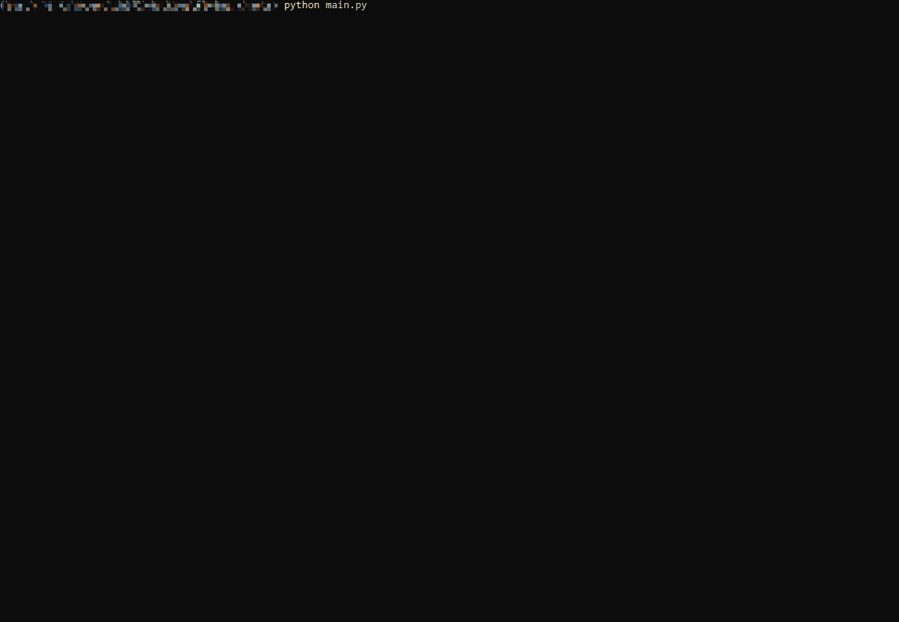

# Spanish airports flying charts personal repository

Downloads all AD2 and AD3 flying charts from www.aip.es and creates a local repository.

Multithreading and progress bar.

## Folder structure
```bash
C:\USERS\CHIFL\DESKTOP\FLYING_CHARTS
│   .coverage
│   aip_functions.py
│   airports.py
│   LICENCE.txt
│   main.py
│   MIT-LICENSE.txt
│   README.md
│   requirements.txt
│   __init__.py
│
├───test
    │   test_aip_functions.py
    │   __init__.py
```

## Usage

```bash
python main.py
```



## Testing

Unittest covering 66% of aip functions.

```bash
pip install discover
```
```bash
python -m unittest discover -b -v
```
```bash
test_create_airport_folders (test.test_aip_functions.TestAipFunctions)
Test if folder structure is created ... ok                            
test_create_path (test.test_aip_functions.TestAipFunctions)
Test parent folder name format ... ok
test_create_url (test.test_aip_functions.TestAipFunctions)
Test if a URL is created ... ok
Test if the function returns a pdf file name ... ok
test_parse_pdf (test.test_aip_functions.TestAipFunctions)
Test if airport charts are parsed from soup ... ok

----------------------------------------------------------------------
Ran 5 tests in 1.241s

OK
```
## Test report

```bash
 coverage report -m
```
```bash
Name                         Stmts   Miss  Cover   Missing
----------------------------------------------------------
__init__.py                      1      1     0%   1
aip_functions.py                53     18    66%   72, 79, 90-114
airports.py                      1      0   100%
test\__init__.py                 0      0   100%
test\test_aip_functions.py      35      5    86%   16-18, 71, 75
----------------------------------------------------------
TOTAL                           90     24    73%

```

## Roadmap

- Ask for a particular airport to download.
- Cancel download if AIRAC cycle has not changed.

## License

[MIT](https://choosealicense.com/licenses/mit/)